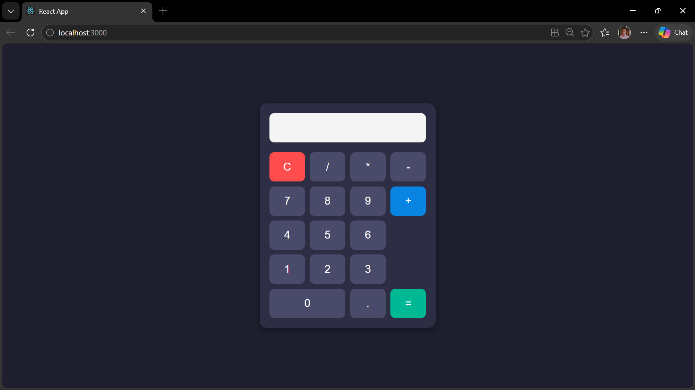

# Ex04 Simple Calculator - React Project

## AIM
To  develop a Simple Calculator using React.js with clean and responsive design, ensuring a smooth user experience across different screen sizes.

## ALGORITHM
### STEP 1
Create a React App.

### STEP 2
Open a terminal and run:
  <ul><li>npx create-react-app simple-calculator</li>
  <li>cd simple-calculator</li>
  <li>npm start</li></ul>

### STEP 3
Inside the src/ folder, create a new file Calculator.js and define the basic structure.

### STEP 4
Plan the UI: Display screen, number buttons (0-9), operators (+, -, *, /), clear (C), and equal (=).

### STEP 5
Create a new file Calculator.css in src/ and add the styling.

### STEP 6
Open src/App.js and modify it.

### STEP 7
Start the development server.
  npm start

### STEP 8
Open http://localhost:3000/ in the browser.

### STEP 9
Test the calculator by entering numbers and operations.

### STEP 10
Fix styling issues and refine content placement.

### STEP 11
Deploy the website.

### STEP 12
Upload to GitHub Pages for free hosting.

## PROGRAM

# App.js

```js
import React, { useState } from "react";
import "./App.css";

function App() {
  const [input, setInput] = useState("");

  const handleClick = (value) => {
    setInput(input + value);
  };

  const clearInput = () => {
    setInput("");
  };

  const calculateResult = () => {
    try {
      setInput(eval(input).toString());
    } catch {
      setInput("Error");
    }
  };

  return (
    <div className="container">
      <div className="calculator">
        <input type="text" value={input} readOnly className="display" />

        <div className="buttons">
          <button onClick={clearInput} className="clear">
            C
          </button>
          <button onClick={() => handleClick("/")} >/</button>
          <button onClick={() => handleClick("*")} >*</button>
          <button onClick={() => handleClick("-")} >-</button>

          <button onClick={() => handleClick("7")} >7</button>
          <button onClick={() => handleClick("8")} >8</button>
          <button onClick={() => handleClick("9")} >9</button>
          <button onClick={() => handleClick("+")} className="plus">
            +
          </button>

          <button onClick={() => handleClick("4")} >4</button>
          <button onClick={() => handleClick("5")} >5</button>
          <button onClick={() => handleClick("6")} >6</button>

          <button onClick={() => handleClick("1")} >1</button>
          <button onClick={() => handleClick("2")} >2</button>
          <button onClick={() => handleClick("3")} >3</button>

          <button onClick={() => handleClick("0")} className="zero">
            0
          </button>

          <button onClick={() => handleClick(".")} >.</button>

          <button onClick={calculateResult} className="equal">
            =
          </button>
        </div>
      </div>
    </div>
  );
}

export default App;
```

# App.css

```css
body {
  margin: 0;
  padding: 0;
  background: #1e1e2f;
  font-family: Arial, sans-serif;
}

.container {
  display: flex;
  justify-content: center;
  align-items: center;
  height: 100vh;
}

.calculator {
  background: #2d2d44;
  padding: 20px;
  border-radius: 15px;
  width: 320px;
  box-shadow: 0px 4px 15px rgba(0, 0, 0, 0.4);
}

.display {
  width: 100%;
  height: 60px;
  margin-bottom: 20px;
  font-size: 28px;
  text-align: right;
  padding-right: 10px;
  border: none;
  border-radius: 10px;
  background: #f4f4f4;
  color: #000;
  box-sizing: border-box;
}

.buttons {
  display: grid;
  grid-template-columns: repeat(4, 1fr);
  gap: 10px;
}

button {
  height: 60px;
  border: none;
  border-radius: 10px;
  font-size: 22px;
  cursor: pointer;
  background: #4a4a6a;
  color: white;
  transition: 0.2s;
}

button:hover {
  background: #6a6a9a;
}

.clear {
  background: #ff4d4d;
}

.clear:hover {
  background: #ff6666;
}

.equal {
  background: #00b894;
}

.equal:hover {
  background: #00d1a0;
}

.plus {
  grid-row: span 2;
  background: #0984e3;
}

.plus:hover {
  background: #339af0;
}

.zero {
  grid-column: span 2;
}
```

## OUTPUT



## RESULT
The program for developing a simple calculator in React.js is executed successfully.
